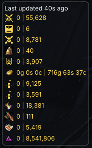
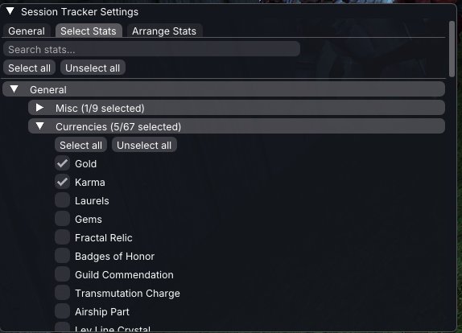
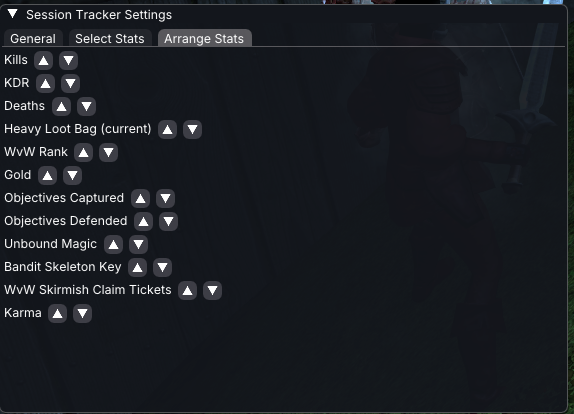
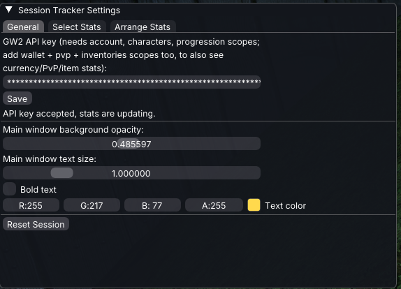

# Session Tracker

[](https://github.com/albrektsson/gw2-session-tracker/actions/workflows/ci.yml)
[](https://github.com/albrektsson/gw2-session-tracker/actions/workflows/github-code-scanning/codeql)
[](https://github.com/albrektsson/gw2-session-tracker/actions/workflows/dependabot/dependabot-updates)

A [Raidcore Nexus](https://raidcore.gg/Nexus) addon for Guild Wars 2 that
shows a window of GW2 stats, each tracked as both a **session** value (how
much it's increased since a tracking session started) and a **lifetime**
value (the account's all-time total). It's a native-addon counterpart to
the Blish HUD module `ecksofa.sessiontracker`
([`Taschenbuch/BlishHud-SessionTracker`](https://github.com/Taschenbuch/BlishHud-SessionTracker)),
aiming to mirror as much of its functionality as possible. See
[`AGENT.md`](./AGENT.md) for the full product vision.

## Screenshots

| Main window | Select Stats |
|---|---|
|  |  |

| Arrange Stats | General settings |
|---|---|
|  |  |

## Structure

A 3-crate Cargo workspace:

- **`crates/core`** (`session_tracker_core`) — pure logic: GW2 API
  response parsing, the stat catalog, session/lifetime delta math, and
  config file persistence. No Nexus or Windows dependency, so it builds
  and tests on any platform.
- **`crates/net`** (`session_tracker_net`) — the GW2 API HTTP client
  (via `ureq`) and the background polling thread/shared app state. Still
  fully cross-platform.
- **`crates/addon`** (`session_tracker`) — the actual Nexus addon
  (`cdylib`). Depends on [`nexus-rs`](https://github.com/Zerthox/nexus-rs)
  for the ImGui windows, keybinds, and addon entry point. This is the
  only crate that's Windows-only and needs cross-compilation.

## Building

Native logic (`core`/`net`) builds and tests on any platform with a
standard Rust toolchain:

```sh
cargo test -p session_tracker_core -p session_tracker_net
```

The addon itself (`session_tracker`) is Windows-only and needs the
`x86_64-pc-windows-gnu` target plus a MinGW-w64 cross-compiler, since it
depends on `nexus-rs` (which pulls in the `windows` crate and a vendored
C++ ImGui backend):

```sh
rustup target add x86_64-pc-windows-gnu
# install a mingw-w64 cross toolchain, e.g.:
#   brew install mingw-w64          (Homebrew)
#   dnf install mingw64-gcc mingw64-gcc-c++   (Fedora)

cargo build --release --target x86_64-pc-windows-gnu -p session_tracker
```

This produces `target/x86_64-pc-windows-gnu/release/session_tracker.dll`.
`.cargo/config.toml` already sets up the linker and static-linking flags
needed to avoid runtime MinGW DLL dependencies — no extra flags needed.
Copy the built DLL into your GW2 install's Nexus `addons` folder to load
it in-game.

## License

MIT — see [`LICENSE`](./LICENSE).

Some stat icons (`crates/addon/assets/icons/`) are by
[Lorc](https://lorcblog.blogspot.com), [Delapouite](https://delapouite.com),
and Skoll from [game-icons.net](https://game-icons.net), licensed under
[CC BY 3.0](https://creativecommons.org/licenses/by/3.0/).

## Contributing

Contributions are welcome — please open a pull request, or open an issue
first if you'd like to discuss a change before writing it.
